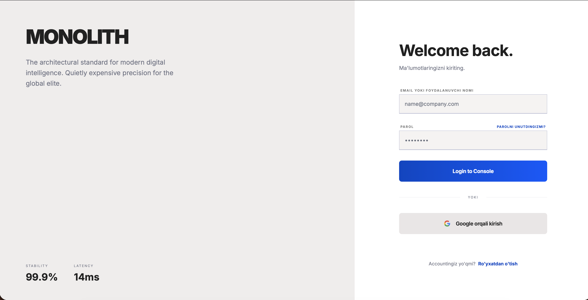
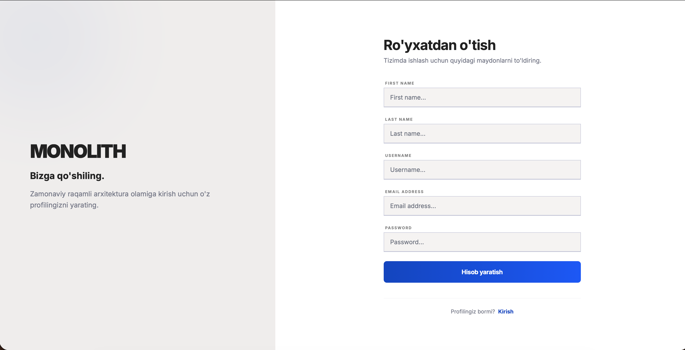
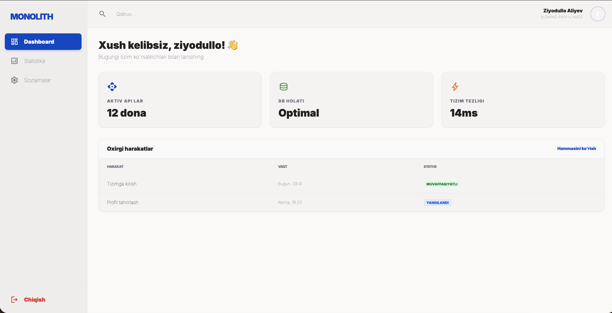

```markdown
# 🏛️ MONOLITH - Django Auth System

Ushbu loyiha zamonaviy **Django** freymvorki va **Tailwind CSS** yordamida yaratilgan eksklyuziv autentifikatsiya tizimidir. Loyiha ham oddiy login/register, ham Google orqali kirish (OAuth2) imkoniyatlarini o'z ichiga oladi.

---

## 📸 Loyiha ko'rinishi (Screenshots)

Loyihaning interfeysi "Monolith" dizayn tilida yaratilgan:

### 🔑 Kirish sahifasi (Login)

*Zamonaviy ikki panelli dizayn: chap tomonda brending va o'ng tomonda login formasi.*

### 📝 Ro'yxatdan o'tish (Register)

*Foydalanuvchi ma'lumotlarini yig'ish va xatoliklarni real-vaqtda ko'rsatish tizimi.*

### 🖥️ Asosiy boshqaruv paneli (Dashboard)

*Tizim statistikasi, oxirgi harakatlar va foydalanuvchi profili boshqaruvi.*

### 🔌 Google Integratsiyasi

*Django-allauth yordamida Google orqali xavfsiz kirish tizimi.*

---

## 🚀 O'rnatish va Sozlash

Loyihani ishga tushirish uchun quyidagi ketma-ketlikni bajaring:

### 1. Muhitni tayyorlash
```bash
# Virtual muhitni yaratish va aktivlashtirish
python -m venv venv
source venv/bin/activate  # Linux/macOS
# venv\Scripts\activate   # Windows

# Kutubxonalarni o'rnatish
pip install -r requirements.txt
```

### 2. Konfiguratsiya (.env)
Loyihaning sozlamalarini o'rnatish uchun `src` papkasiga o'ting va namunaviy fayldan nusxa oling:
```bash
cd src
cp .env.example .env
```
> **Muhim:** `.env` faylini oching va `DEBUG`, `SECRET_KEY`, hamda ma'lumotlar bazasi ulanishlarini to'g'rilang.

### 3. Ma'lumotlar bazasi va Admin
```bash
python manage.py migrate
python manage.py createsuperuser
```

---

## 🛠️ Google OAuth2 ni sozlash (Admin Panel orqali)

Google orqali kirish ishlashi uchun:
1. [Google Cloud Console](https://console.cloud.google.com/)'dan **Client ID** va **Secret Key** oling.
2. `/admin` panelga kiring.
3. **Sites** bo'limida domen nomini to'g'rilang (masalan: `127.0.0.1:8000`).
4. **Social Applications** bo'limiga kiring va yangi ilova qo'shing:
   - Provider: **Google**
   - Name: **Monolith Auth**
   - Client id: `SIZNING_CLIENT_ID`
   - Secret key: `SIZNING_SECRET_KEY`
   - Sites: `127.0.0.1:8000` ni tanlab o'ng tomonga o'tkazing.

---

## 📂 Loyiha strukturasi
- `src/` - Django loyihasining asosiy kodi.
- `venv/` - Virtual muhit (Git-ga yuklanmaydi).
- `requirements.txt` - Kerakli kutubxonalar ro'yxati.
- `*.png / *.jpg` - Loyiha interfeysi skrinshotlari.

---

**Muallif:** Ziyodullo Aliyev  
**Sohasi:** Backend va Full-stack dasturchi
```